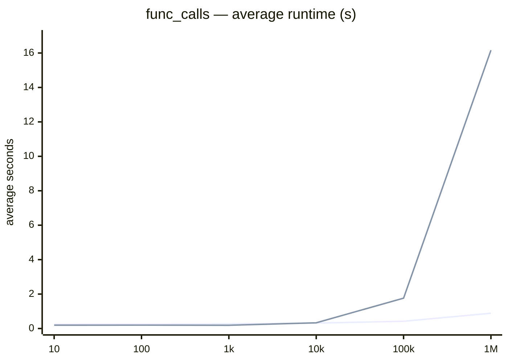
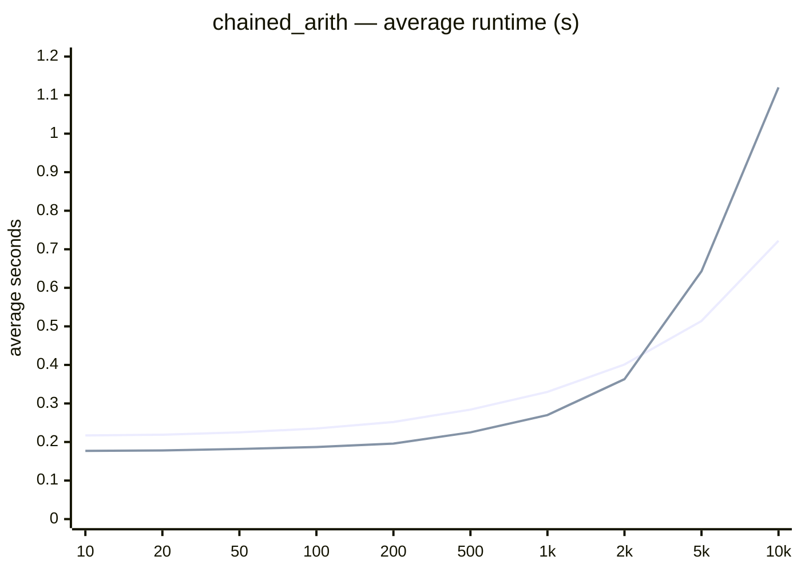
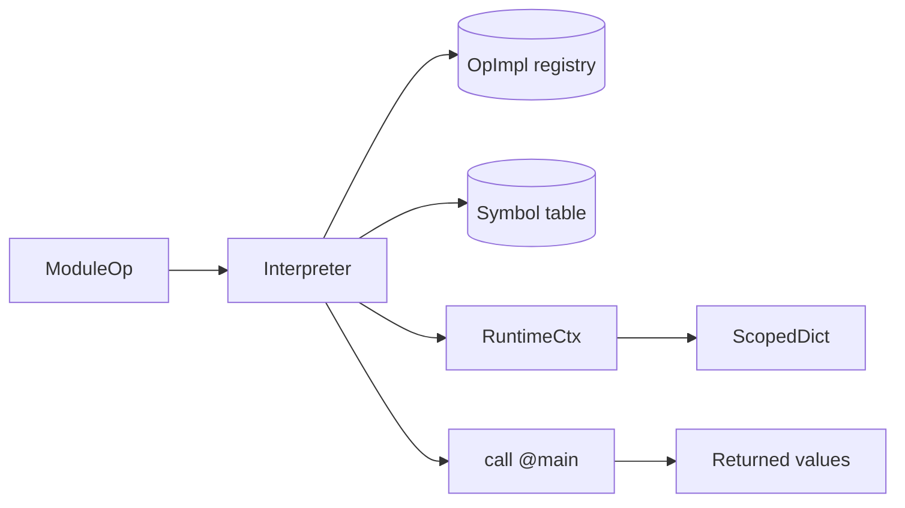

# ScaIR MLIR Interpreter

[](https://github.com/edin-dal/scair/actions/workflows/tests.yml)
[](https://codecov.io/github/edin-dal/scair)
[](https://github.com/edin-dal/scair/blob/main/LICENSE)

ScaIR's extensible interpreter infrastructure for MLIR. It enables high-level interpretation and execution of MLIR SSA programs (complete with its own bookkeeping and execution engine) without lowering. To accommodate the open-endedness of MLIR dialects, operation and dialect implementation logic can be extended by overriding the registry in `./interpreter/src/InterpreterDialects.scala`.

## Contents

- [Overview](#overview)
- [Features](#features)
- [Getting started](#getting-started)
- [Supported operations](#supported-operations)
- [UG4 dissertation](#ug4-dissertation)
- [Evaluation](#evaluation)
- [Current limitations](#current-limitations)
- [How it works](#how-it-works)
- [Testing](#testing)
- [Layout](#layout)

## Overview

The `interpreter` module adds an execution path to ScaIR. It is used by the `scair-run` command-line tool (defined in `tools/runTool`), which:

1. Parses an `.mlir` file or stdin.
2. Registers the supported dialects from the extensible dialect registry (see [Adding an operation](#adding-an-operation)).
3. Invokes the interpreter on the `.mlir` file.
4. Returns the result once execution completes.

## Features

- Direct execution of MLIR programs, without lowering
- Scoped SSA value tracking with parent-scope lookup
- Structured and multi-block CFG control flow handling
- Core helper functions for implementation logic (e.g. `push_scope`, `get_values`)
- Built-in support for the `arith`, `memref`, and `scf` dialects, among others

## Getting started

### Prerequisites

- A checkout of this repository
- Mill — use the `./mill` wrapper from the repository root

### Run a program

Start by running `tests/filecheck/interpreter/arith/simpleadd.mlir` — it creates two constants and adds them:

```mlir
builtin.module {
  func.func @main() -> i64 {
    %0 = "arith.constant"() <{value = 30 : i64}> : () -> i64
    %1 = "arith.constant"() <{value = 28 : i64}> : () -> i64
    %2 = "arith.addi"(%0, %1) <{overflowFlags = #arith.overflow<none>}> : (i64, i64) -> i64
    func.return %2 : i64
  }
}
```

Run it from the repository root:

```bash
./mill tools.runTool.run tests/filecheck/interpreter/arith/simpleadd.mlir
```

The interpreter parses the file, finds `func.func @main`, executes it, and prints the returned value:

```text
Result: 58
```

A few things to keep in mind when trying other programs:

- The interpreter can only execute the operations and dialects listed under [Supported operations](#supported-operations); anything else fails with an unsupported-operation error.
- Execution always starts at `func.func @main`. If no `main` symbol exists, the interpreter fails with `Function main not found`.
- If you don't pass a file argument, `scair-run` reads IR from stdin.

More complete programs can be found under `tests/filecheck/interpreter/`.

## Supported operations

| Dialect | Operations | Notes |
| --- | --- | --- |
| `arith` | `constant`, `addi`, `subi`, `muli`, `divsi`, `divui`, `andi`, `ori`, `xori`, `shli`, `shrsi`, `shrui`, `cmpi`, `select` | integer operands only |
| `func` | `func`, `call`, `return`, built-in `@print` | `@print` writes a single operand to stdout |
| `memref` | `alloc`, `load`, `store` | backed by `ShapedArray` |
| `scf` | `for`, `if`, `yield` | loop-carried values supported |
| LLVM terminators | `llvm.br`, `llvm.cond_br`, `llvm.return`, `llvm.unreachable` | drive multi-block control flow; `llvm.return` returns from the function |

## UG4 dissertation

This work was developed as part of a UG4 dissertation on high-level interpretation of MLIR. The key dissertation findings, comparing this interpreter to xDSL's, a python-based compiler framework, are summarised below.

### Findings

- The interpreter allows for more conciseness when defining operations compared to xDSL: up to 28.8% fewer LoC (Arith), 18.8% fewer for MemRef (see [Evaluation](#evaluation) below).
- Faster than xDSL on all four loop-based benchmark programs at their largest size, e.g. 1M looped function calls and iterative Fibonacci up to N = 1M (see [Evaluation](#evaluation) below).

## Evaluation

Comparative evaluation of ScaIR vs xDSL on implementation conciseness and runtime performance.

### Implementation conciseness

LoC to implement operation semantics (core logic only, no boilerplate):

| Dialect | Framework | # of Ops | Total LoC | Avg LoC per Op | % Reduction (ScaIR vs xDSL) |
| --- | --- | --- | --- | --- | --- |
| Arith | ScaIR | 12 | 42 | 3.50 | 28.8% |
| Arith | xDSL | 12 | 59 | 4.92 | — |
| Func | ScaIR | 2 | 2 | 1.00 | 0.0% |
| Func | xDSL | 2 | 2 | 1.00 | — |
| MemRef | ScaIR | 3 | 13 | 4.34 | 18.8% |
| MemRef | xDSL | 3 | 16 | 5.34 | — |
| SCF | ScaIR | 2 | 8 | 4.00 | 0.0% |
| SCF | xDSL | 2 | 8 | 4.00 | — |

ScaIR matches or beats xDSL LoC on every dialect (28.8% fewer for Arith, 18.8% for MemRef, equal for Func/SCF) while adding compile-time type safety.

### Runtime performance

Average (mean) wall-clock seconds over 10 runs for each benchmark at its largest size (1M looped function calls, 1M load-add-store iterations, Fibonacci to N = 1M, and 10k chained additions):

| Benchmark | Size | xDSL (s) | ScaIR (s) |
| --- | --- | --- | --- |
| func_calls | 1000000 | 16.164 | 0.888 |
| memref | 1000000 | 14.729 | 0.993 |
| fib | 1000000 | 8.143 | 0.664 |
| chained_arith | 10000 | 1.120 | 0.722 |

ScaIR interpreted beats xDSL on every benchmark at its largest size: 18× faster on 1M looped function calls, 15× on 1M load-add-store iterations, 12× on Fibonacci to N = 1M, and 1.5× on 10k chained additions. Benchmarked on an Apple M5 MacBook Pro (2026).

All three looped benchmarks (`func_calls`, `memref`, `fib`) scale the same way, so `func_calls` is shown as a representative alongside the straight-line `chained_arith`.

<details>
<summary>Average runtime (s) across all benchmarked sizes</summary>

The titles use the example program names from `tests/filecheck/interpreter/full-programs/` (`func_calls.mlir`, `fib.mlir`, `memref_tester.mlir`; `chained_arith` is generated by `chained_arith.py`). Key: in both charts the line ending higher at the largest size is xDSL; the lower line is ScaIR.





</details>

## Current limitations

- Integer arithmetic only — no floats, index, vector, tensor, or complex values
- `arith.constant` supports `IntegerAttr` only
- Signedness is not modeled; signed and unsigned variants use Scala `Int` semantics
- `memref` stores are limited to `Int` values
- The entry point is fixed to `@main`
- External calls are limited to the built-in `@print`

## How it works

| Component | Responsibility |
| --- | --- |
| `Interpreter` | Walks the module, dispatches operations, maintains the symbol table |
| `OpImpl` | Per-operation implementation: `compute` returns results, which are stored in the current context |
| `OpTerminatorImpl` | Terminator implementation: returns a `CFGStep` (jump to a block or return) plus produced values |
| `RuntimeCtx` | Holds the active `ScopedDict` and creates nested scopes |
| `ScopedDict` | Maps SSA `Value`s to runtime values, falling back to parent scopes |
| `ShapedArray` | Row-major array backing `memref` values |



### Adding an operation

Implement `OpImpl` for the operation and register it in an `InterpreterDialect`:

```scala
import scair.interpreter.*
import scair.dialects.arith

object run_maxsi extends OpImpl[arith.MaxSI]:
  def compute(
      op: arith.MaxSI,
      interpreter: Interpreter,
      ctx: RuntimeCtx,
      args: Seq[Any],
  ): Seq[Any] =
    args match
      case Seq(lhs: Int, rhs: Int) => Seq(lhs.max(rhs))
      case _ => throw new Exception("MaxSI operands must be integers")

val extendedDialects =
  allInterpreterDialects :+ Seq(run_maxsi)
```

Pass `extendedDialects` when constructing the interpreter:

```scala
val interpreter = new Interpreter(module, extendedDialects)
```

Terminators follow the same pattern, but implement `OpTerminatorImpl` and return a `CFGStep` describing where control flow goes next:

```scala
object run_my_br extends OpTerminatorImpl[my.Br]:
  def computeTerminator(
      op: my.Br,
      interpreter: Interpreter,
      ctx: RuntimeCtx,
      args: Seq[Any],
  ): (CFGStep, Seq[Any]) =
    (CFGStep.Jump(op.dest, args), Seq())
```

### Adding a dialect

An `InterpreterDialect` is a sequence of operation and terminator implementations:

```scala
type InterpreterDialect =
  Seq[OpImpl[? <: Operation] | OpTerminatorImpl[? <: Operation]]
```

There is no separate dialect class to implement — a dialect is just the impls grouped together:

```scala
val myDialect: InterpreterDialect = Seq(run_maxsi, run_my_br)
```

As with dialect registration for ScaIR tools, there are two common ways to make it available to the interpreter:

* When using ScaIR as a library: extend `ScairRunBase` (in `scair.tools.runTool`) and override `interpreterDialects` to append your dialect:

```scala
object MyRun extends ScairRunBase:
  override def interpreterDialects =
    scair.interpreter.allInterpreterDialects :+ myDialect
```

* When working within ScaIR itself: add the dialect to `allInterpreterDialects` in `interpreter/src/InterpreterDialects.scala`.

The interpreter is then constructed with the extended list, as shown in [Adding an operation](#adding-an-operation).

## Testing

- Unit tests: `./mill interpreter.test` — runs the module's unit tests
- Filecheck tests: `./mill filechecks` — runs the lit programs under `tests/filecheck/interpreter/`
- Full pipeline: `./mill testAll` — runs the full ScaIR test suite, including this module

## Layout

```text
interpreter/
├── src/
│   ├── Interpreter.scala          # engine and RuntimeCtx
│   ├── InterpreterDialects.scala  # built-in dialect registry
│   ├── ScopedDict.scala           # scoped SSA value storage
│   ├── ShapedArray.scala          # memref backing store
│   └── Dialects/
│       ├── Arith.scala
│       ├── Func.scala
│       ├── LLVM.scala
│       ├── Memref.scala
│       └── scf.scala
└── test/
    └── src/
        └── ToolsTest.scala
```
