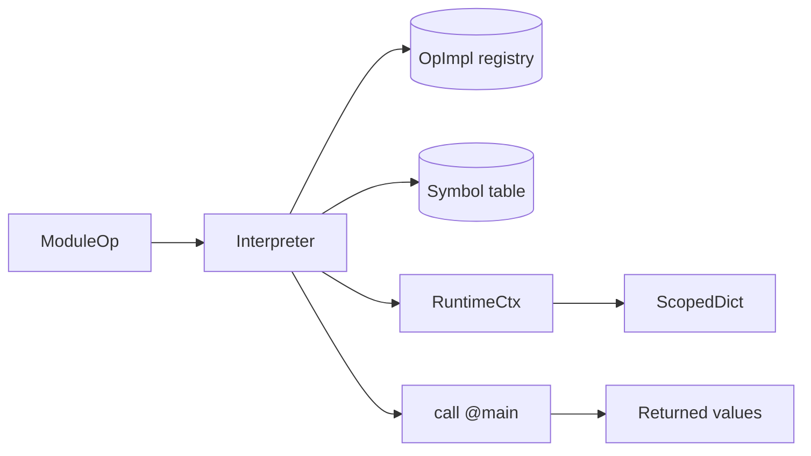

# ScaIR MLIR Interpreter

[](https://github.com/edin-dal/scair/actions/workflows/tests.yml)
[](https://codecov.io/github/edin-dal/scair)
[](https://github.com/edin-dal/scair/blob/main/LICENSE)

ScaIR's extensible interpreter infrastructure for MLIR. Enables the high-level interpretation and execution of MLIR programs through its bookkeeping and execution engine, all without lowering. To fully accomodate the open-endedness of MLIR dialects, the tool allows for the extension of per-dialect and per-operation implementation logic.

## Overview

The `interpreter` module adds an execution path to ScaIR. It is used by the `scair-run` command-line tool (defined in `tools/runTool`), which:

1. parses an `.mlir` file or stdin,
2. registers the available supported dialects
3. invokes the interpreter on the `.mlir` file
4. returns the result once execution is completed

## Features

- Direct MLIR-level execution of MLIR programs
- Scoped SSA value tracking with parent-scope lookup
- Structured and multi-block CFG control flow handling
- Function calls, recursion, and a built-in `@print`
- Extensible operation implementations via the `OpImpl` trait
- Terminator dispatch via the `OpTerminatorImpl` trait
- Extensible dialect implementations via the `InterpreterDialects` class
- Supports the `arith`, `memref`, `scf` dialects among others

## Getting started

### Prerequisites

- A checkout of this repository
- Mill — use the `./mill` wrapper from the repository root

### Run a program

Create `add.mlir`:

```mlir
builtin.module {
  func.func @main() -> i64 {
    %0 = "arith.constant"() <{value = 30 : i64}> : () -> i64
    %1 = "arith.constant"() <{value = 28 : i64}> : () -> i64
    %2 = "arith.addi"(%0, %1) <{overflowFlags = #arith.overflow<none>}> : (i64, i64) -> i64
    func.return %2 : i64
  }
}
```

Run it from the repository root:

```bash
./mill tools.runTool.run add.mlir
```

Output:

```text
Result: 58
```

> [!IMPORTANT]
> Execution always starts at `func.func @main`. If no `main` symbol exists, the interpreter fails with `Function main not found`.

When no file argument is given, `scair-run` reads IR from stdin.

## Examples

### Loops and loop-carried values

```mlir
builtin.module {
  func.func @main() -> (i32) {
    %n    = "arith.constant"() <{value = 10 : i32}> : () -> i32
    %lb   = "arith.constant"() <{value = 0 : i32}> : () -> i32
    %step = "arith.constant"() <{value = 1 : i32}> : () -> i32

    %a0   = "arith.constant"() <{value = 0 : i32}> : () -> i32
    %b0   = "arith.constant"() <{value = 1 : i32}> : () -> i32

    %a_res, %b_res = "scf.for"(%lb, %n, %step, %a0, %b0) ({
    ^bb0(%iv: i32, %a: i32, %b: i32):
      %next = "arith.addi"(%a, %b) <{overflowFlags = #arith.overflow<none>}> : (i32, i32) -> i32
      "scf.yield"(%b, %next) : (i32, i32) -> ()
    }) : (i32, i32, i32, i32, i32) -> (i32, i32)

    %fib_n = "arith.addi"(%a_res, %lb) <{overflowFlags = #arith.overflow<none>}> : (i32, i32) -> i32

    func.return %fib_n : i32
  }
}
```

```text
Result: 55
```

See examples of more complete programs in `tests/filecheck/interpreter/`.

## Supported operations

| Dialect | Operations | Notes |
| --- | --- | --- |
| `arith` | `constant`, `addi`, `subi`, `muli`, `divsi`, `divui`, `andi`, `ori`, `xori`, `shli`, `shrsi`, `shrui`, `cmpi`, `select` | integer operands only |
| `func` | `func`, `call`, `return`, built-in `@print` | `@print` writes a single operand to stdout |
| `memref` | `alloc`, `load`, `store` | backed by `ShapedArray` |
| `scf` | `for`, `if`, `yield` | loop-carried values supported |
| LLVM terminators | `llvm.br`, `llvm.cond_br`, `llvm.return`, `llvm.unreachable` | drive multi-block control flow; `llvm.return` returns from the function |

## How it works

| Component | Responsibility |
| --- | --- |
| `Interpreter` | Walks the module, dispatches operations, maintains the symbol table |
| `OpImpl` | Per-operation implementation: `compute` returns results, which are stored in the current context |
| `OpTerminatorImpl` | Terminator implementation: returns a `CFGStep` (jump to a block or return) plus produced values |
| `RuntimeCtx` | Holds the active `ScopedDict` and creates nested scopes |
| `ScopedDict` | Maps SSA `Value`s to runtime values, falling back to parent scopes |
| `ShapedArray` | Row-major array backing `memref` values |



### Adding an operation

Implement `OpImpl` for the operation and register it in an `InterpreterDialect`:

```scala
import scair.interpreter.*
import scair.dialects.arith

object run_maxsi extends OpImpl[arith.MaxSI]:
  def compute(
      op: arith.MaxSI,
      interpreter: Interpreter,
      ctx: RuntimeCtx,
      args: Seq[Any],
  ): Seq[Any] =
    args match
      case Seq(lhs: Int, rhs: Int) => Seq(lhs.max(rhs))
      case _ => throw new Exception("MaxSI operands must be integers")

val extendedDialects =
  allInterpreterDialects :+ Seq(run_maxsi)
```

Pass `extendedDialects` when constructing the interpreter:

```scala
val interpreter = new Interpreter(module, extendedDialects)
```

Terminators follow the same pattern, but implement `OpTerminatorImpl` and return a `CFGStep` describing where control flow goes next:

```scala
object run_my_br extends OpTerminatorImpl[my.Br]:
  def computeTerminator(
      op: my.Br,
      interpreter: Interpreter,
      ctx: RuntimeCtx,
      args: Seq[Any],
  ): (CFGStep, Seq[Any]) =
    (CFGStep.Jump(op.dest, args), Seq())
```

## Testing

- Unit tests: `./mill interpreter.test` — runs the module's unit tests
- Filecheck tests: `./mill filechecks` — runs the lit programs under `tests/filecheck/interpreter/`
- Full pipeline: `./mill testAll`

## Current limitations

- Integer arithmetic only — no floats, index, vector, tensor, or complex values
- `arith.constant` supports `IntegerAttr` only
- Signedness is not modeled; signed and unsigned variants use Scala `Int` semantics
- `memref` stores are limited to `Int` values
- The entry point is fixed to `@main`
- External calls are limited to the built-in `@print`

## Layout

```text
interpreter/
├── src/
│   ├── Interpreter.scala          # engine and RuntimeCtx
│   ├── InterpreterDialects.scala  # built-in dialect registry
│   ├── ScopedDict.scala           # scoped SSA value storage
│   ├── ShapedArray.scala          # memref backing store
│   └── Dialects/
│       ├── Arith.scala
│       ├── Func.scala
│       ├── LLVM.scala
│       ├── Memref.scala
│       └── scf.scala
└── test/
    └── src/
        └── ToolsTest.scala
```

## UG4 Dissertation

<!-- TODO: describe the UG4 dissertation this work was part of -->

## Findings

<!-- TODO: add the dissertation findings -->

